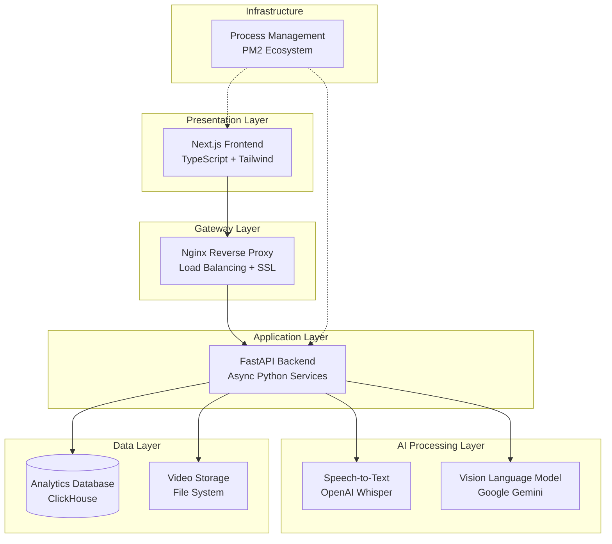
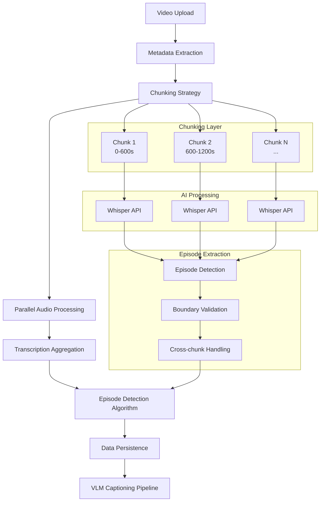
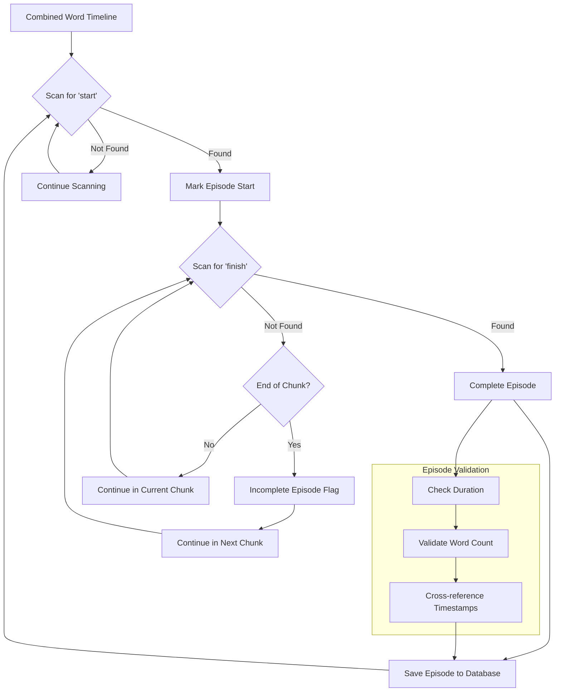
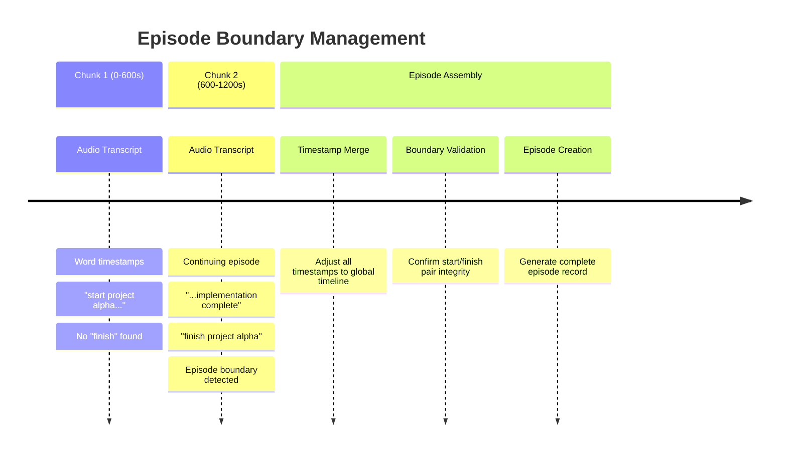
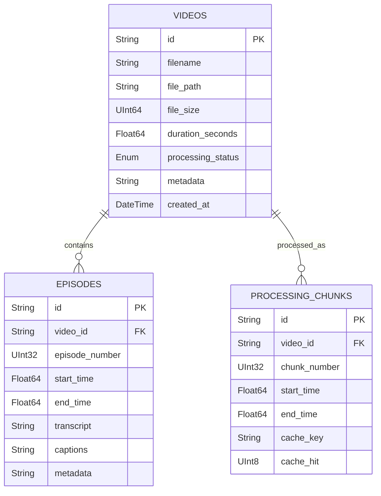
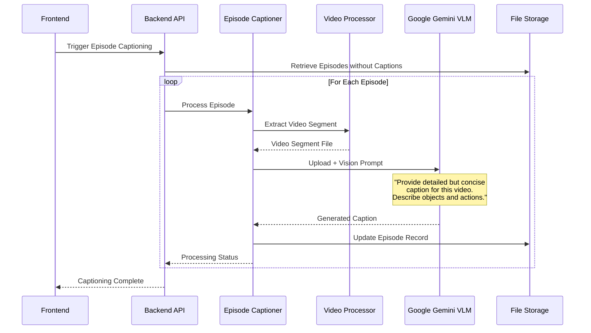

# Video Processing Platform - System Architecture

## Overview

This is an annotation platform designed to analyze videos containing structured content. The system automatically transcribes video audio, extracts discrete episodes based on delimiter words, and generates visual captions using advanced Vision Language Models. The architecture is modular to scale components independently.

## High-Level Architecture

## Architectural Design Principles

### Layered Architecture Pattern
The system follows a clean layered architecture with clear separation of concerns:

- **Presentation Layer**: React-based UI with server-side rendering
- **Gateway Layer**: Reverse proxy handling routing and SSL
- **Application Layer**: Business logic and API orchestration
- **AI Processing Layer**: External AI service integrations (OpenAI, Google Gemini)
- **Data Layer**: Persistent storage and analytics database

### Key Design Patterns

**Service-Oriented Architecture (SOA)**
- Microservice-like separation of video processing, episode management, and analytics
- Each service handles specific domain responsibilities
- Loose coupling between components

**Event-Driven Processing**
- Asynchronous video processing workflows
- Background task execution for resource-intensive operations
- Real-time status updates and progress tracking

**Connection Pooling**
- Database connection pool management for high-concurrency scenarios
- Configurable pool sizes and connection lifecycle management

**Caching Strategy**
- Intelligent caching of transcription results to avoid reprocessing
- Hash-based cache keys for video segments

## Video Processing Architecture

### Core Processing Pipeline

### Video Chunking Strategy

The system employs an intelligent chunking strategy to handle videos of arbitrary length while maintaining processing efficiency and memory constraints.

```mermaid
gantt
    title Video Chunking Timeline (90-minute video example)
    dateFormat X
    axisFormat %M:%S

    section Audio Extraction
    Chunk 1 (0-10min)      :chunk1, 0, 600
    Chunk 2 (10-20min)     :chunk2, 600, 600
    Chunk 3 (20-30min)     :chunk3, 1200, 600
    Chunk 4 (30-40min)     :chunk4, 1800, 600
    Chunk 5 (40-50min)     :chunk5, 2400, 600

    section Transcription
    Whisper API Call 1     :whisper1, 0, 200
    Whisper API Call 2     :whisper2, 600, 200
    Whisper API Call 3     :whisper3, 1200, 200
    Whisper API Call 4     :whisper4, 1800, 200
    Whisper API Call 5     :whisper5, 2400, 200

    section Processing
    Timestamp Adjustment   :timestamp, 1000, 500
    Episode Detection      :episode, 1500, 800
    Database Storage       :storage, 2300, 200
```

### Episode Extraction Algorithm

The core innovation lies in the intelligent episode detection algorithm that can handle delimiter words spanning across multiple chunks.

### Cross-Chunk Episode Handling

One of the most complex architectural challenges is handling episodes that span multiple processing chunks.

## Data Architecture

### Database Design (ClickHouse)

The system uses ClickHouse as its primary database due to its exceptional performance with time-series data, analytics queries, and JSON metadata support.

### Connection Architecture
- **Connection Pooling**: Thread-safe connection pool with configurable size limits
- **Query Optimization**: Async query execution with timeout handling
- **Analytics Optimization**: Specialized queries for dashboard metrics

## Vision Language Model Integration

### VLM Architecture Pattern

The system integrates Google Gemini VLM to generate visual captions for extracted video episodes, providing a complete multimodal understanding of the content.

### VLM Processing Strategy

**Smart Episode Selection:**
- Skip episodes with existing captions
- Prioritize recent or high-importance episodes
- Batch processing with rate limiting

**Error Resilience:**
- Automatic retry mechanisms
- Fallback handling for API failures
- Graceful degradation when VLM unavailable

**Resource Management:**
- Temporary file cleanup
- Memory-efficient video segment processing
- API quota management

## API Design

### RESTful Architecture

The system follows RESTful principles with clear resource-oriented endpoints:

| Resource | Operations | Purpose |
|----------|------------|---------|
| **Videos** | GET, POST | Video management and processing |
| **Episodes** | GET, PUT | Episode retrieval and annotation |
| **Analytics** | GET | System metrics and insights |
| **Captioning** | POST | VLM visual caption generation |

### API Characteristics

- **Async Processing**: Long-running operations handled via background tasks
- **Pagination Support**: Efficient data retrieval for large datasets
- **Status Tracking**: Real-time processing status updates
- **Error Handling**: Comprehensive error responses with actionable messages

## Performance & Scalability

### Architectural Optimizations

**Connection Pool Management**
- Thread-safe database connection pooling
- Configurable pool sizes and connection lifecycles
- Automatic connection cleanup and recovery

**Intelligent Caching Strategy**
- Hash-based cache keys for transcription segments
- Avoid reprocessing identical video chunks
- Memory-efficient cache management

**Asynchronous Processing**
- Background task execution for CPU-intensive operations
- Non-blocking API responses
- Real-time status updates through database polling

### Scalability Design

**Horizontal Scaling Capabilities**
- Stateless API design enables load balancing
- ClickHouse supports distributed clustering
- Configurable storage backends (local, cloud)

**Resource Management**
- Chunked processing prevents memory overflow
- Configurable processing limits
- Smart episode selection for VLM processing

## Technology Stack Overview

| Layer | Technology | Key Benefits |
|-------|------------|--------------|
| **Frontend** | Next.js, TypeScript | Server-side rendering, type safety |
| **Backend** | FastAPI, Python | High performance async API |
| **Database** | ClickHouse | Analytics-optimized, time-series data |
| **AI/ML** | OpenAI Whisper, Google Gemini | Speech-to-text, vision understanding |
| **Infrastructure** | Nginx, PM2, Docker-ready | Production scalability |

## Architectural Design Choices

### Intelligent Episode Detection
- **Cross-chunk Boundary Handling**: Episodes can span multiple processing chunks
- **Incomplete Episode Management**: Handles missing start/end delimiters gracefully
- **Timestamp Synchronization**: Maintains accurate timing across chunk boundaries

### Multimodal AI Integration
- **Dual AI Pipeline**: Combines audio transcription with visual understanding
- **Smart Processing**: Skip logic prevents redundant VLM processing
- **Resource Optimization**: Efficient video segment extraction and cleanup

### Scalable Data Architecture
- **Caching Strategy**: Hash-based transcription result caching
- **Analytics Optimization**: ClickHouse enables complex real-time queries

## Future Architecture Considerations

**Scalability Enhancements:**
- Message queue integration (Redis/RabbitMQ) for new video or asynchronous episode processing
- Cloud storage abstraction layer

**Dataset Management:**
- Materialize episodes into individual video files
- Add motor sequences with each episode and create a multimodal dataset
- For each episode assign tags for filtering or training on specific events/episodes

**Analytics/Enrichment:**
- Assign episode quality (blurry video, incomplete video)

**Operational Excellence:**
- Comprehensive monitoring and alerting
- Performance metrics and optimization
